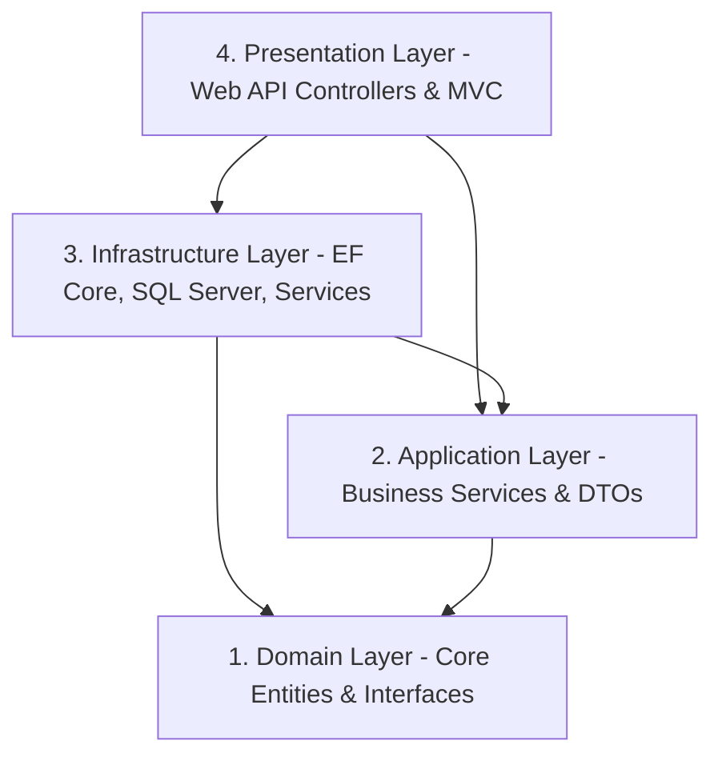
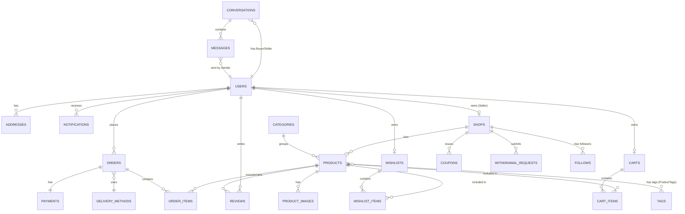
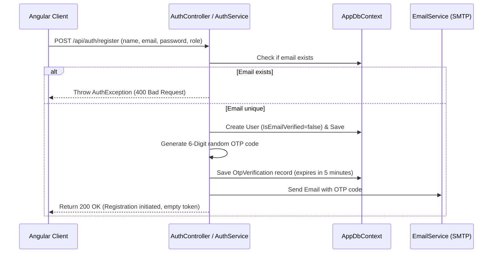
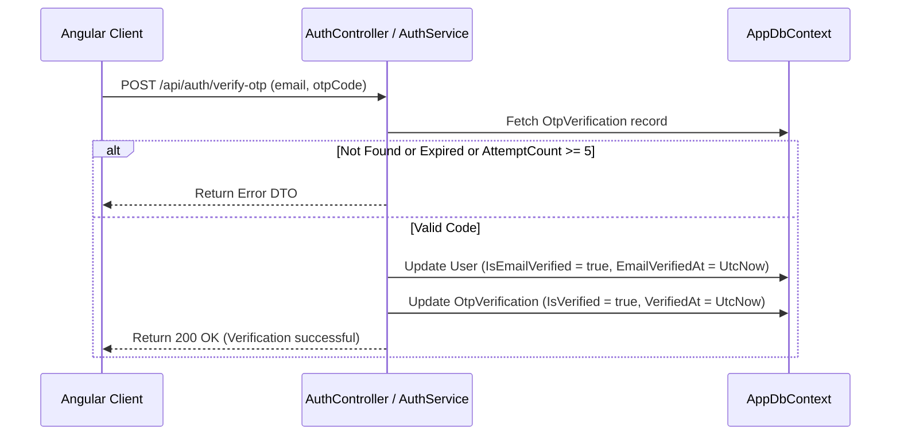
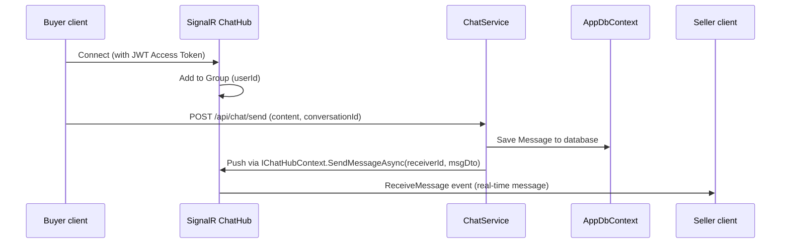
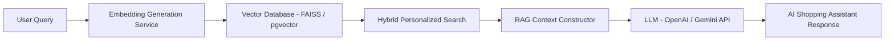
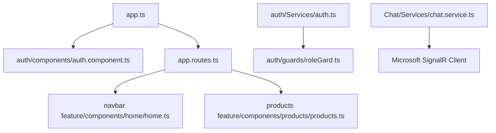

# Handora: AI-Enhanced Handmade Marketplace
## Professional Enterprise-Level Project Documentation

This document serves as the master technical blueprint and analytical documentation for **Handora**, an AI-enhanced e-commerce platform that connects customers, creators, shop owners, and administrators. It details the backend and frontend systems, database design, API endpoints, payment systems, SignalR real-time communications, security, current project status, and technical debt.

---

## Table of Contents
1. [Task 1: Repository & Business Domain Analysis](#task-1-repository--business-domain-analysis)
2. [Task 2: Architectural Blueprints & Patterns](#task-2-architectural-blueprints--patterns)
3. [Task 3: Detailed Folder Structure Analysis](#task-3-detailed-folder-structure-analysis)
4. [Task 4: Database Model & Entity-Relationship Diagram (ERD)](#task-4-database-model--entity-relationship-diagram-erd)
5. [Task 5: Authentication, Authorization & Security Tokens](#task-5-authentication-authorization--security-tokens)
6. [Task 6: Enterprise API Endpoint Reference](#task-6-enterprise-api-endpoint-reference)
7. [Task 7: Implemented & Planned Feature Inventory](#task-7-implemented--planned-feature-inventory)
8. [Task 8: SignalR Real-Time Communication Pipelines](#task-8-signalr-real-time-communication-pipelines)
9. [Task 9: Escrow & Paymob Payment Integration Architecture](#task-9-escrow--paymob-payment-integration-architecture)
10. [Task 10: Proposed AI Architectures (Personalized Search, Recommendation & RAG)](#task-10-proposed-ai-architectures-personalized-search-recommendation--rag)
11. [Task 11: Angular Frontend Single-Page Application (SPA) Analysis](#task-11-angular-frontend-single-page-application-spa-analysis)
12. [Task 12: Comprehensive Security Audit & Review](#task-12-comprehensive-security-audit--review)
13. [Task 13: Project Completion Status Report Matrix](#task-13-project-completion-status-report-matrix)
14. [Task 14: Technical Debt & Architectural Assessment](#task-14-technical-debt--architectural-assessment)
15. [Task 15: Installation & Developer Operations Guide](#task-15-installation--developer-operations-guide)

---

## Task 1: Repository & Business Domain Analysis

### Purpose of the Platform
**Handora** is a niche e-commerce marketplace dedicated to **handmade, artisanal, and customized products**. Unlike generic e-commerce platforms, it honors the unique characteristics of handmade items by providing specialized tools for creators, shop personalization, escrow-based payment security, and direct buyer-seller real-time communication. 

### Business Model
Handora functions as a **two-sided marketplace** generating revenue via the following channels:
1. **Commission on Sales**: The platform charges a configurable commission rate (defaulting to 10%) on every successful sale.
2. **Escrow Hold & Refund Window**: To guarantee customer satisfaction, payment for delivered orders is held in escrow for **14 days** (to accommodate local consumer protection refund regulations) before being split into platform commission and seller net earnings.
3. **Admin-Facilitated Payouts**: Creators can view their available balance and request bank/wallet withdrawals, which are processed by admins.

### User Types (Roles)
* **Buyer (Customer)**: Browses products, manages a wishlist/shopping cart, completes checkouts, interacts with sellers, rates/reviews products, and follows favorite shops.
* **Seller (Artisan/Creator)**: Owns a customizable Shop profile, lists products with multiple images, manages coupons, fulfills orders, views balances (pending and available), and requests payouts.
* **Administrator**: Verifies shops, updates order status globally, views user details, manages configurations, and executes payout approvals.

### Core Workflows
```
[Customer places Order] ➔ [Escrow creates Paymob Intent] ➔ [Customer pays via Card/Mobile Wallet]
                                                                        │
[Funds released after 14-day hold] ➔ [Seller Pen. Balance ➔ Avail. Balance] ➔ [Seller marks Delivered]
          │
[Seller requests Payout] ➔ [Admin approves and executes payment]
```

---

## Task 2: Architectural Blueprints & Patterns

### Onion Architecture Layers
Handora's backend is designed using **Onion (Clean) Architecture** principles. It separates the business logic from infrastructure concerns, ensuring the domain layer remains decoupled from external dependencies.



* **Domain Layer (Core)**: Free of dependencies. Contains domain entities (`Product`, `Shop`, `User`, `Order`), custom enums, and repository interfaces.
* **Application Layer**: Contains business services (`ProductService`, `CartService`, `PaymentService`), request/response DTOs, SignalR interfaces, and object mappers. It depends only on the Domain Layer.
* **Infrastructure Layer**: Contains the data access implementation (`AppDbContext`), repositories (`ProductRepository`, `UnitOfWork`), DB configurations, and seeders. It depends on both Domain and Application.
* **Presentation Layer**: The entry point. Consists of ASP.NET Core Web API controllers (`ProductsController`, `AuthController`) exposing RESTful endpoints.

### Implemented Design Patterns
1. **Repository Pattern**: Concrete repository implementations (e.g., `ProductRepository`) inherit from a base `GenericRepository<TEntity, TId>`. This encapsulates EF Core database queries.
2. **Unit of Work Pattern**: The `IUnitOfWork` interface coordinates database writes across multiple repositories under a single transaction context, ensuring ACID compliance.
3. **Specification Pattern**: Standard implementation of this pattern is **not currently present** in the codebase. Database querying is handled via direct LINQ operations inside repositories and services. We recommend adding a specification engine in the future to keep queries DRY.
4. **Dependency Injection**: Services are registered with the DI container using `.AddScoped()` or `.AddSingleton()` extension methods in `ModuleInfrastructureDependences` and `ModuleApplicationDependences`.

---

## Task 3: Detailed Folder Structure Analysis

```
Handora Backend Workspaces
├── HandoraDomain
│   ├── Consts            # Application-wide system roles (AppRoles)
│   ├── Interfaces        # Contracts for UOW, Generic & Specific Repositories
│   └── Models            # Domain Models grouped by domain aggregates (AppUser, CartEntities, etc.)
├── HandoraApplication
│   ├── DTOs              # Request/Response data contracts for all features
│   ├── Helpers           # Authentication utility classes (JwtHelper)
│   ├── Hubs              # Interface contracts for SignalR hubs (IChatHub)
│   ├── IServices         # Core business logic service contracts
│   ├── Mappers           # Mapster configurations and profiles
│   └── Services          # Implementations of core services (AuthService, OrderService)
├── HandoraInfrastructure
│   ├── Data              # EF Core context and DB Configurations
│   ├── Migrations        # Database history tracking files
│   ├── Repositries&UOW   # Implementation of repository patterns and Unit of Work
│   └── Seeders           # Initial seed data generators for users, products, categories
└── HandoraApi
    ├── Controllers       # Web API Endpoints
    ├── Extensions        # Startup configuration extensions (Identity, Db, Redis)
    └── Hubs              # SignalR Chat & Notification hubs
```

---

## Task 4: Database Model & Entity-Relationship Diagram (ERD)

### Relational Model Map
The database consists of **22 main entities** mapped to SQL Server tables via EF Core:

| Entity Name | Purpose | Key Attributes | Relationships |
| :--- | :--- | :--- | :--- |
| `User` | User identity accounts | `Id (PK)`, `Name`, `Token`, `IsEmailVerified` | 1-to-M with `Address`, `Order`, `Review`, `Notification`; 1-to-1 with `WishList`, `Cart`, `Shop` |
| `Shop` | Customizable merchant profiles | `Id (PK)`, `OwnerId (FK)`, `AvailableBalance`, `PendingBalance` | M-to-1 with `User`; 1-to-M with `Product`, `Coupon`, `WithdrawalRequest` |
| `Product` | Listings for handmade products | `Id (PK)`, `CategoryId (FK)`, `Price`, `AverageRating` | M-to-1 with `Shop`, `Category`; 1-to-M with `ProductImage`, `Review`; M-to-M with `Tag` |
| `Order` | Customer purchase receipts | `Id (PK)`, `UserId (FK)`, `PaymentStatus`, `Status` | M-to-1 with `User`, `DeliveryMethod`; 1-to-M with `OrderItem`; 1-to-1 with `Payment` |
| `Payment` | Transaction details | `Id (PK)`, `OrderId (FK)`, `Provider`, `Amount` | 1-to-1 with `Order` |
| `OtpVerification` | Short-term email validation | `Id (PK)`, `Email`, `OtpCode`, `ExpiresAt` | 1-to-M with `User` (referenced via `UserId`) |
| `WithdrawalRequest` | Seller balance payout files | `Id (PK)`, `ShopId (FK)`, `Amount`, `Status` | M-to-1 with `Shop`, `User` |
| `Conversation` | Text-chat groups between accounts | `Id (PK)`, `BuyerId (FK)`, `SellerId (FK)` | M-to-1 with `User` (Buyer & Seller); 1-to-M with `Message` |
| `Message` | Chat transcripts | `Id (PK)`, `ConversationId (FK)`, `Content`, `IsRead` | M-to-1 with `Conversation`, `User` (Sender) |

### Entity-Relationship Diagram (ERD)



---

## Task 5: Authentication, Authorization & Security Tokens

### Authentication Flows

#### User Registration Flow (With OTP Verification)


#### OTP Verification Flow


#### JWT Token Structure
Upon successful login, a JWT token is generated by `JwtHelper.GenerateToken` with the following contents:
* **Issuer / Audience**: Loaded from configuration settings (`Jwt:Issuer`, `Jwt:Audience`).
* **Token Lifetime**: Configured via `Jwt:DurationInMinutes` (usually 60 minutes).
* **Claims**:
  * `ClaimTypes.NameIdentifier`: Store User's `Id` GUID.
  * `ClaimTypes.Email`: Store User's registered email.
  * `ClaimTypes.Role`: Store assigned roles (e.g., `Buyer`, `Seller`, `Admin`).

---

## Task 6: Enterprise API Endpoint Reference

This section details the primary Web API routes configured in Handora.

### 1. AuthController (Base: `/api/auth`)
* **`POST /api/auth/register`**: Accepts multipart form data. Initiates registration and dispatches OTP email. Returns `AuthResponseDto` with empty token.
* **`POST /api/auth/verify-otp`**: Accepts JSON containing email and 6-digit OTP code. If valid, changes account email verification status.
* **`POST /api/auth/resend-otp`**: Resets the OTP attempt counts, generates a new code, and resends it.
* **`POST /api/auth/login`**: Authenticates user against hashed password and checks that `IsEmailVerified = true`, `IsBanned = false`, and `IsDeleted = false`. Returns JWT token.
* **`GET /api/auth/users`**: (Admin only) Lists all accounts.

### 2. ProductsController (Base: `/api/products`)
* **`GET /api/products`**: (Anonymous) Fetches paginated products. Supports query parameters: `Search`, `CategoryId`, `ShopId`, `MinPrice`, `MaxPrice`, `MinRating`, `SortBy`, `SortDescending`.
* **`GET /api/products/{id}`**: (Anonymous) Retrieves details including images, shop details, category, and recent reviews.
* **`POST /api/products`**: (Sellers only) Multi-part form request to upload new product attributes and images to Cloudinary.
* **`PUT /api/products/{id}`**: (Sellers only) Updates specifications, tags, adds new images, and deletes existing image IDs.

### 3. CartController (Base: `/api/cart`)
* **`GET /api/cart`**: Reads `cartId` from browser cookies (or generates a new UUID) and fetches the active cart state.
* **`POST /api/cart`**: Appends product to cart with quantities.
* **`DELETE /api/cart/{productId}`**: Removes specific item from anonymous cart.

### 4. PaymentsController (Base: `/api/payments`)
* **`POST /api/payments/create-intent/{orderId}`**: (Buyers only) Authenticates user and initiates Paymob order creation. Returns the Paymob payment iframe checkout URL.
* **`POST /api/payments/webhook`**: (Anonymous) Listens to Paymob webhook events to verify transaction outcomes and update orders.

---

## Task 7: Implemented & Planned Feature Inventory

| Feature | Sub-Feature | Status | Notes |
| :--- | :--- | :--- | :--- |
| **Authentication** | Registration + Login | **Complete** | ASP.NET Core Identity & JWT integration. |
| | OTP Verification | **Complete** | SMTP-based 6-digit verification code. |
| **Shop Management** | Shop Profiles | **Complete** | CRUD operations with image logo uploads. |
| | Top Shops & Stats | **Complete** | Denormalized statistical sales reports. |
| **Product Aggregate** | Catalog Searching | **Complete** | Database-level LINQ search. |
| | Review System | **Complete** | Average rating calculation updates. |
| **Wishlist & Cart** | Anonymous Cart | **Complete** | HttpOnly Cookie-based cart tracking. |
| **Order Processing** | Checkout & Delivery | **Complete** | DeliveryMethod database configurations. |
| **Real-time Pipeline** | Chat Systems | **Complete** | SignalR conversation-based chat message routing. |
| | Live Notifications | **Complete** | SignalR live unread counts indicators. |
| **Integrations** | Cloudinary | **Complete** | Automatic image storage service. |
| | Paymob Escrow | **Complete** | Iframe payments with 14-day hold window. |
| | Fawry | **Missing** | Planned for cash checkouts (not implemented). |
| **AI Features** | RAG / Recommendations | **Missing** | Planned; no C# services exist in source. |

---

## Task 8: SignalR Real-Time Communication Pipelines



---

## Task 9: Escrow & Paymob Payment Integration Architecture

```
[Buyer checkout] ➔ [Create Paymob Order via API] ➔ [Receive Payment Key] ➔ [Redirect to Iframe]
                                                                                   │
[Hold 14 days] ➔ [Release: Pending ➔ Available Balance] ➔ [Verify HMAC Webhook] ➔ [Paymob pays]
```

### Webhook Verification Security
To verify incoming Paymob requests, the platform reads the raw payload and computes an HMAC-SHA512 hash using the configured webhook secret. The hash is compared to the `X-Paymob-Signature` header to ensure authenticity.
> [!NOTE]
> Webhook signature verification is temporarily commented out/disabled in `PaymentService.VerifyWebhookAsync` for testing purposes. It must be enabled for production setups.

---

## Task 10: Proposed AI Architectures

The codebase does not currently contain AI services. Below is the proposed design for the planned AI subsystems:



1. **Personalized Search & Recommendation**:
   * **Model**: SentenceTransformers (e.g., `all-MiniLM-L6-v2`) to generate embeddings for product descriptions.
   * **Database**: Integrate a vector extension (e.g., PostgreSQL `pgvector` or FAISS) to retrieve similar products.
2. **RAG (Retrieval-Augmented Generation) & Agentic AI**:
   * **Execution**: Construct a chat assistant inside the Angular frontend. When a user asks about products (e.g., "Find a blue wool scarf under $30"), the system queries vector store records, constructs a context prompt, and sends it to LLMs (OpenAI/Gemini) to return personalized shopping advice.

---

## Task 11: Angular Frontend Single-Page Application (SPA) Analysis

The frontend app uses Angular with a component-based layout:



* **Guards & Interceptors**:
  * `roleGuard`: Reads `localStorage.getItem('user')` to match roles before allowing access.
  * `authInterceptor`: Automatically appends HTTP header: `Authorization: Bearer <Token>`.
* **State Management**: Uses Angular **Signals** (`signal`, `computed`, `update`) in services (e.g., `ChatService` and `products-service`) to update UI components dynamically.
* **SignalR Client**: Integrates `@microsoft/signalr` directly in Angular services to establish WebSockets connections.

---

## Task 12: Comprehensive Security Audit & Review

1. **JWT Handling**: Stored in `localStorage` in the frontend client. Token lifetime validation is performed on the server.
2. **Authentication Bypass Concerns**:
   > [!WARNING]
   > The `WishListController.cs` contains endpoints that read the current user ID using `GetUserId()`, but **lacks the `[Authorize]` attribute** on the class and actions. Calling these endpoints anonymously causes null references or security flaws.
3. **Database Input Validation**: EF Core prevents SQL injection via parameterized queries.
4. **File Uploads**: Admin and seller uploads are routed to Cloudinary via the server, which validates mime-types and limits size.

---

## Task 13: Project Completion Status Report Matrix

| Module | Status | Completion % | Notes |
| :--- | :--- | :--- | :--- |
| **User Identity & Auth** | Complete | 100% | Registration, login, and OTP validation works. |
| **Shop Management** | Complete | 100% | Full CRUD operations. |
| **Product Listings** | Complete | 100% | Catalog listing, pricing, and images work. |
| **Checkout & Cart** | Complete | 95% | Cart works; Checkout depends on Paymob. |
| **Real-time Messaging** | Complete | 100% | Live chat and notification hubs are functional. |
| **Paymob Webhook Integration** | Complete | 90% | Needs HMAC verification enabled for production. |
| **Payout & Withdrawal System** | Partial | 60% | The business logic works, but actual payouts are simulated. |
| **AI Systems** | Missing | 0% | AI components are not yet implemented. |
| **Fawry Integration** | Missing | 0% | Fawry payment integration is not implemented. |

---

## Task 14: Technical Debt & Architectural Assessment

1. **Duplicate Queries**: Repositories use `.Include()` statements repeatedly. We recommend using the **Specification Pattern** to centralize query structures.
2. **Authorization Bugs**: Add `[Authorize]` to `WishListController` to prevent potential runtime errors for anonymous sessions.
3. **Webhook Security**: Enable Webhook signature verification in production settings.
4. **Hardcoded Strings**: Typographical errors in folder structures (`WishListEntoties`, `Repositries&UOW`) should be refactored to prevent confusion, and spelling discrepancies in API names should be corrected.

---

## Task 15: Installation & Developer Operations Guide

### Environment Variables (.env / appsettings.json)
Configure the following properties in `HandoraApi/appsettings.json`:
```json
{
  "ConnectionStrings": {
    "DefaultConnection": "Server=localhost;Database=HandoraDb;Trusted_Connection=True;TrustServerCertificate=True;"
  },
  "Jwt": {
    "Key": "YOUR_SECRET_JWT_KEY_MIN_32_CHARS",
    "Issuer": "HandoraIssuer",
    "Audience": "HandoraAudience",
    "DurationInMinutes": 60
  },
  "Paymob": {
    "BaseUrl": "https://accept.paymob.com",
    "ApiKey": "YOUR_PAYMOB_API_KEY",
    "IntegrationId": "123456",
    "IframeId": "7890",
    "WebhookSecret": "YOUR_PAYMOB_WEBHOOK_HMAC_SECRET"
  },
  "Cloudinary": {
    "CloudName": "YOUR_CLOUD_NAME",
    "ApiKey": "YOUR_API_KEY",
    "ApiSecret": "YOUR_API_SECRET"
  }
}
```

### Running Backend API
1. Navigate to the project root:
   ```bash
   cd HandoraApi
   ```
2. Apply database migrations:
   ```bash
   dotnet ef database update
   ```
3. Run the development server:
   ```bash
   dotnet run
   ```
   *The server runs locally at `http://localhost:5000` / `https://localhost:5001`. Swagger is available at `/swagger` in development.*

### Running Frontend SPA
1. Navigate to the frontend directory:
   ```bash
   cd c:\Users\EG.LAP\Downloads\handmade\handmade
   ```
2. Install client dependencies:
   ```bash
   npm install
   ```
3. Run the development server:
   ```bash
   npm start
   ```
   *The Angular application launches locally at `http://localhost:4200`.*
