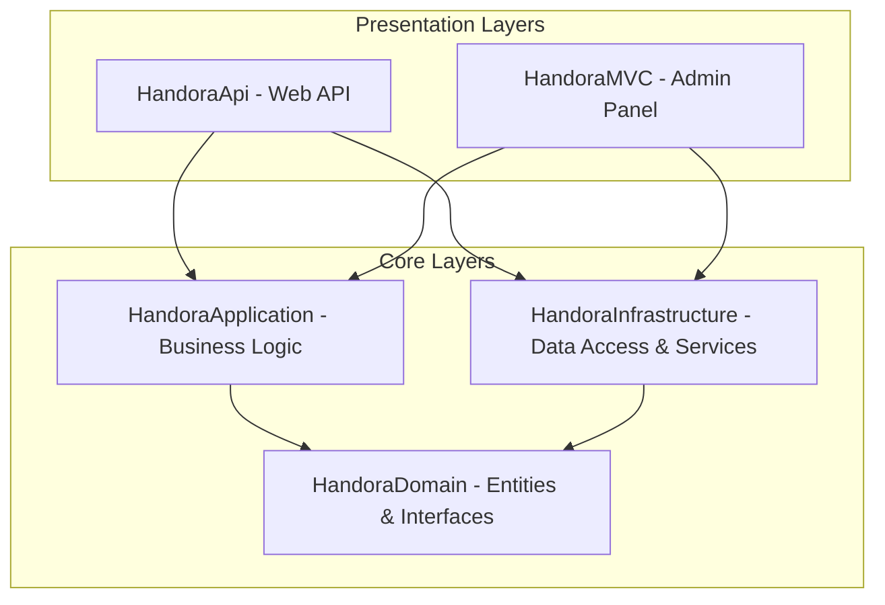

# Handora - Handmade Products Marketplace Technical Reference

This document serves as the definitive technical reference and "Single Source of Truth" for the Handora backend project. It outlines the hybrid architecture, project directories, database entities, key services, and standards required for future modifications and enhancements (specifically the MVC Admin panel).

---

## 1. Project Overview & Architecture

### Purpose
**Handora** is a bilingual (Arabic & English) multi-vendor e-commerce marketplace designed specifically for handmade, artisanal products. It enables **Sellers** to establish virtual shops, list products, track orders, and manage financial balance details. **Buyers** can search and filter products, manage a cart and wishlist, follow shops, submit reviews, and chat in real-time with sellers. The system supports payment processing (escrowed via Paymob) and email verification using OTP.

### Hybrid Architecture
The project is structured following the principles of **Clean Architecture** (Separation of Concerns, Dependency Inversion) and uses a hybrid presentation layout:



1. **Web API Presentation Layer ([HandoraApi](file:///g:/ITI/16-%20Handmade%20Project/Handmade-Project/Handora/HandoraApi))**: 
   - Exposes RESTful JSON endpoints for mobile and client web applications.
   - Authenticates requests statelessly using JWT Bearer tokens.
   - Hosts real-time hubs for messaging and notifications via SignalR.
2. **MVC Presentation Layer ([HandoraMVC](file:///g:/ITI/16-%20Handmade%20Project/Handmade-Project/Handora/HandoraMVC))**:
   - Web application for administrative back-office actions (e.g., categories management, order management, shop verification).
   - Utilizes standard Razor views, view models, and standard Cookie-based authentication.
3. **Core Layers**:
   - **[HandoraDomain](file:///g:/ITI/16-%20Handmade%20Project/Handmade-Project/Handora/HandoraDomain)**: Pure C# library containing domain model entities, enums, value objects, and repository interfaces. Has no framework or database dependencies.
   - **[HandoraApplication](file:///g:/ITI/16-%20Handmade%20Project/Handmade-Project/Handora/HandoraApplication)**: Houses core business services, interfaces, Data Transfer Objects (DTOs), hubs, mapping configurations, and helpers.
   - **[HandoraInfrastructure](file:///g:/ITI/16-%20Handmade%20Project/Handmade-Project/Handora/HandoraInfrastructure)**: Manages persistence, database context (`AppDbContext`), EF Core migrations, repository implementations, Unit of Work, and configurations for external integrations (e.g., Paymob, SMTP).

---

## 2. Directory Structure

Below is the directory tree structure of the `Handora` backend workspace:

```
Handora/
├── HandoraDomain/                       # Pure Domain Layer
│   ├── Consts/                          # Global constants
│   ├── Interfaces/                      # Domain repository interfaces
│   └── Models/                          # Core domain entities (grouped by aggregate)
│
├── HandoraApplication/                  # Core Application Layer (Business Logic)
│   ├── DTOs/                            # Data Transfer Objects (Request/Response models)
│   ├── Helpers/                         # Security & business helper logic (e.g., JWT)
│   ├── Hubs/                            # Real-time SignalR Hub definitions
│   ├── IServices/                       # Application service interfaces
│   ├── Mappers/                         # Mapster mapping configuration
│   ├── Services/                        # Application service implementations
│   └── ModuleApplicationDependences.cs  # central DI registration for application layer
│
├── HandoraInfrastructure/               # Infrastructure Layer (Persistence & Integration)
│   ├── Data/                            # AppDbContext & Fluent Configurations
│   ├── Migrations/                      # Entity Framework Core migrations
│   ├── Repositries&UOW/                 # Concrete repository implementations & Unit of Work
│   ├── Seeders/                         # Database initial seed scripts
│   ├── Settings/                        # Paymob & external settings mapping classes
│   └── ModuleInfrastructureDependences.cs # central DI registration for infrastructure
│
├── HandoraApi/                          # Web API Presentation Layer (JWT Auth)
│   ├── Controllers/                     # REST Web API controllers
│   ├── Extensions/                      # Startup initialization methods (CORS, JWT, Redis)
│   ├── Middleware/                      # Global exception and localization middleware
│   └── Program.cs                       # API bootstrap configuration
│
└── HandoraMVC/                          # MVC Admin Presentation Layer (Cookie Auth)
    ├── Controllers/                     # MVC admin panel controllers
    ├── ViewModels/                      # MVC-specific views data transfer models
    ├── Views/                           # MVC Razor views (Categories, Orders, Shared)
    ├── wwwroot/                         # CSS, JS, and image static files
    └── Program.cs                       # MVC bootstrap configuration
```

---

## 3. Database & Models

### Database Context
The persistence engine uses **Entity Framework Core** pointing to SQL Server.
- The context class is **[AppDbContext.cs](file:///g:/ITI/16-%20Handmade%20Project/Handmade-Project/Handora/HandoraInfrastructure/Data/AppDbContext.cs)**, which inherits from `IdentityDbContext` to support ASP.NET Core Identity.
- Entity mappings and relationships are configured using Fluent API configurations located under `HandoraInfrastructure/Data/Configuration/`.

### Core Entities & Relationships

| Entity Group | Class Name | Database Table | Responsibility / Key Fields | Relationships |
| :--- | :--- | :--- | :--- | :--- |
| **Authentication & Profile** | **[User.cs](file:///g:/ITI/16-%20Handmade%20Project/Handmade-Project/Handora/HandoraDomain/Models/AppUser/User.cs)** | `AspNetUsers` | Extends Identity User. Contains `IsEmailVerified`, `IsBanned`, `ProfileImage`, and `Bio`. | 1-to-1 with `Shop`, 1-to-many with `Addresses`, `Orders`, `Reviews`, `Notifications`. |
| | **[Address.cs](file:///g:/ITI/16-%20Handmade%20Project/Handmade-Project/Handora/HandoraDomain/Models/AppUser/Address.cs)** | `Addresses` | User physical addresses (bilingual details). | Belongs to `User`. |
| | **[OtpVerification.cs](file:///g:/ITI/16-%20Handmade%20Project/Handmade-Project/Handora/HandoraDomain/Models/AppUser/OtpVerification.cs)** | `OtpVerifications` | Tracks 6-digit verification codes, expirations, and remaining attempts. | Belongs to `User`. |
| **Shop Management** | **[Shop.cs](file:///g:/ITI/16-%20Handmade%20Project/Handmade-Project/Handora/HandoraDomain/Models/ShopEntities/Shop.cs)** | `Shops` | Represents seller shop. Stores `AvailableBalance`, `PendingBalance`, `CommissionRate`, `IsVerified`, and ratings. | Belongs to `User` (Owner), Has-many `Products`, `Policies`, `Coupons`, `Reviews` (`ShopReview`), `Followers` (`Follow`). |
| **Product Listings** | **[Product.cs](file:///g:/ITI/16-%20Handmade%20Project/Handmade-Project/Handora/HandoraDomain/Models/ProductEntities/Product.cs)** | `Products` | Stores `Price`, `DiscountPrice`, `Quantity`, status enum (`Active`, `Draft`, `Archived`), and denormalized ratings. | Belongs to `Shop`, Belongs to `Category`, Has-many `Images` (`ProductImage`), `Reviews`, `Tags`. |
| | **[Category.cs](file:///g:/ITI/16-%20Handmade%20Project/Handmade-Project/Handora/HandoraDomain/Models/ProductEntities/Category.cs)** | `Categories` | Hierarchical classification system using bilingual names (`NameEn`, `NameAr`). | Self-referencing (`ParentId`/`SubCategories`), Has-many `Products`. |
| **Order Processing** | **[Order.cs](file:///g:/ITI/16-%20Handmade%20Project/Handmade-Project/Handora/HandoraDomain/Models/OrderEntity/Order.cs)** | `Orders` | Order document stating total amounts, status (`Pending`, `Paid`, `Shipped`, `Delivered`, `Cancelled`), payment status, and shipping information. | Belongs to `User` (Buyer), Has-many `OrderItems`, Has-one `OrderShippingAddress`, Belongs to `DeliveryMethod`, Has-one `Payment`. |
| | **[OrderItem.cs](file:///g:/ITI/16-%20Handmade%20Project/Handmade-Project/Handora/HandoraDomain/Models/OrderEntity/OrderItem.cs)** | `OrderItems` | Snapshot line item capturing `Price` and `Quantity`. Owned snapshot of `ProductItemOrdered`. | Belongs to `Order`. |
| **Seller Ledger** | **[SellerBalanceTransaction.cs](file:///g:/ITI/16-%20Handmade%20Project/Handmade-Project/Handora/HandoraDomain/Models/PaymentEntities/SellerBalanceTransaction.cs)** | `SellerBalanceTransactions` | Financial transaction entries (e.g. Order payments, withdrawal debits). | Belongs to `User`/`Shop`. |
| | **[WithdrawalRequest.cs](file:///g:/ITI/16-%20Handmade%20Project/Handmade-Project/Handora/HandoraDomain/Models/PaymentEntities/WithdrawalRequest.cs)** | `WithdrawalRequests` | Tracks seller fund withdrawal processes and statuses (`Pending`, `Approved`, `Rejected`). | Belongs to `Shop`. |
| **Chat & Messaging** | **[Conversation.cs](file:///g:/ITI/16-%20Handmade%20Project/Handmade-Project/Handora/HandoraDomain/Models/ChatEntities/Conversation.cs)** | `Conversations` | Multi-party chat sessions (usually Buyer-Seller). | Has-many `Messages`. |
| | **[Message.cs](file:///g:/ITI/16-%20Handmade%20Project/Handmade-Project/Handora/HandoraDomain/Models/ChatEntities/Message.cs)** | `Messages` | The specific chat message details. | Belongs to `Conversation`. |

---

## 4. Key APIs & Logic

Administrative MVC controllers should interact exclusively with application services defined in the core logic layer rather than performing direct repository access:

1. **[ICategoryService](file:///g:/ITI/16-%20Handmade%20Project/Handmade-Project/Handora/HandoraApplication/IServices/ICategoryService.cs)**:
   - Manages category CRUD. Admin controllers use this to fetch parent categories, create new subcategories, edit details, and associate imagery.
2. **[IOrderService](file:///g:/ITI/16-%20Handmade%20Project/Handmade-Project/Handora/HandoraApplication/IServices/IOrderService.cs)**:
   - Admin controllers use this service to filter and retrieve user orders (using `OrderQueryDto` queries with sorting, paging, status filters), fetch details, and update the logistics delivery statuses.
3. **[IShopService](file:///g:/ITI/16-%20Handmade%20Project/Handmade-Project/Handora/HandoraApplication/IServices/IShopService.cs)**:
   - Used to review store setups, flag/verify seller storefronts, and manage status logs.
4. **[IPayoutService](file:///g:/ITI/16-%20Handmade%20Project/Handmade-Project/Handora/HandoraApplication/IServices/IPayoutService.cs) & [ICommissionService](file:///g:/ITI/16-%20Handmade%20Project/Handmade-Project/Handora/HandoraApplication/IServices/ICommissionService.cs)**:
   - Calculates marketplace admin commission fee deductions (default is 10%) per sale.
   - Manages withdrawal approvals and handles available/pending balance transitions for shop ledgers.
5. **[IProductService](file:///g:/ITI/16-%20Handmade%20Project/Handmade-Project/Handora/HandoraApplication/IServices/IProductService.cs)**:
   - Manages stock details, catalog listings, catalog reviews, and handles admin warnings/bans on malicious product posts.
6. **[IEmailService](file:///g:/ITI/16-%20Handmade%20Project/Handmade-Project/Handora/HandoraApplication/IServices/IEmailService.cs)**:
   - Triggers transactional notifications (SMTP-based) for account confirmation, verification codes, and invoice statements.

---

## 5. Integration Guidelines for MVC Admin Panel

When developing new pages and features in the MVC Admin Panel (`HandoraMVC`), you must adhere to the following standards to ensure consistency and maintain architectural integrity:

1. **Thin MVC Controllers**:
   - Controllers should do nothing more than parse input, call the application service layer, map response DTOs to local view models, and return the appropriate Razor Views.
   - **Never** perform EF Core database queries (`AppDbContext`) directly inside the controller.
2. **Strict ViewModel Isolation**:
   - Always map application layer DTO results (from `HandoraApplication.DTOs`) to MVC ViewModels (`HandoraMVC.ViewModels`).
   - Do **not** send entities directly to views. This prevents tracking state bugs and accidental leaks of database schema details.
3. **Bilingual Localization Support**:
   - Entities store information in both English and Arabic natively (e.g. `NameEn` and `NameAr`). 
   - Check the selected UI culture and output bilingual fields accordingly. When displaying tables, display English and Arabic titles side-by-side or based on the active locale.
4. **Dependency Injection Configuration**:
   - Shared dependencies (Services, Repositories, Unit of Work) are registered in central extensions:
     - `AddInfrastructureServices(Configuration)` in **[ModuleInfrastructureDependences.cs](file:///g:/ITI/16-%20Handmade%20Project/Handmade-Project/Handora/HandoraInfrastructure/ModuleInfrastructureDependences.cs)**.
     - `AddReposetoriesServices()` in **[ModuleApplicationDependences.cs](file:///g:/ITI/16-%20Handmade%20Project/Handmade-Project/Handora/HandoraApplication/ModuleApplicationDependences.cs)**.
   - Ensure the `HandoraMVC` project registers these assemblies in its `Program.cs` file instead of defining duplicated service registrations.
5. **Security & Role Verification**:
   - Use standard identity checks. The Admin controllers must be decorated with `[Authorize(Roles = "Admin")]` to safeguard access.
   - Ensure the login flow handles redirection to the administrative area if the authenticated user possesses the correct credentials.

---

## 6. Important Configuration

### 1. File Reference Summary
- **Database Context**: [AppDbContext.cs](file:///g:/ITI/16-%20Handmade%20Project/Handmade-Project/Handora/HandoraInfrastructure/Data/AppDbContext.cs)
- **MVC Bootstrap**: [Program.cs (MVC)](file:///g:/ITI/16-%20Handmade%20Project/Handmade-Project/Handora/HandoraMVC/Program.cs)
- **API Bootstrap**: [Program.cs (API)](file:///g:/ITI/16-%20Handmade%20Project/Handmade-Project/Handora/HandoraApi/Program.cs)
- **JWT Options Binding**: [AuthenticationExtension.cs](file:///g:/ITI/16-%20Handmade%20Project/Handmade-Project/Handora/HandoraApi/Extensions/AuthenticationExtension.cs)

### 2. Configuration Settings (`appsettings.json`)
The application relies on several environment settings. Both projects (`HandoraApi` and `HandoraMVC`) maintain local settings files. Ensure the following config blocks are matching:

```json
{
  "ConnectionStrings": {
    "DefaultConnection": "Server=YOUR_SERVER;Database=HandoraDb;Trusted_Connection=True;MultipleActiveResultSets=true;TrustServerCertificate=True;",
    "Redis": "localhost:6379"
  },
  "JwtSettings": {
    "Key": "YOUR_VERY_LONG_SECRET_KEY_FOR_JWT_SIGNING",
    "Issuer": "HandoraIssuer",
    "Audience": "HandoraAudience",
    "DurationInMinutes": 60
  },
  "SmtpSettings": {
    "Server": "smtp.gmail.com",
    "Port": 587,
    "SenderEmail": "example@gmail.com",
    "SenderPassword": "your-smtp-app-password",
    "EnableSsl": true
  },
  "Paymob": {
    "ApiKey": "Paymob_API_Key",
    "IntegrationId": "Payment_Integration_Id",
    "IframeId": "Iframe_ID"
  }
}
```

### 3. Authentication Schemes
- **`HandoraApi`**: Stateless authentication using JWT Tokens. The token validates lifetimes, signatures, and audience constraints.
- **`HandoraMVC`**: Stateful cookie authentication. It configures paths for logins and access denials via `ConfigureApplicationCookie` in the MVC setup:
  ```csharp
  builder.Services.ConfigureApplicationCookie(options =>
  {
      options.LoginPath = "/Account/Login";
      options.AccessDeniedPath = "/Account/AccessDenied";
  });
  ```
